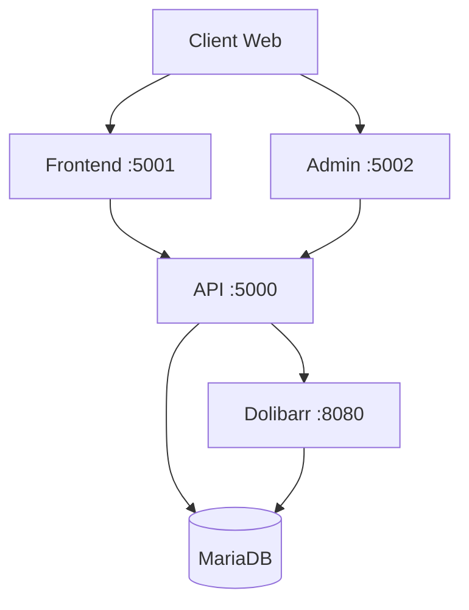

# Le Verger du Coin - E-commerce avec Dolibarr

[](https://opensource.org/licenses/MIT)
[](https://docs.docker.com/compose/)
[](https://www.dolibarr.org/)

Solution e-commerce complète pour producteurs locaux, intégrant un site web moderne avec Dolibarr ERP/CRM.

## 🌟 Fonctionnalités

### Site E-commerce Client
- 🛒 **Catalogue produits** avec filtres par saison et catégorie
- 📦 **Gestion du panier** : ajout, modification et suppression de produits
- 💳 **Processus de commande** simple et intuitif
- 📱 **Design responsive** pour mobile et desktop
- 🎨 **Interface moderne** avec Bootstrap 5

### Panneau d'Administration
- 📊 **Gestion des stocks** en temps réel
- 📈 **Suivi des commandes**
- 👥 **Gestion des clients**
- 📤 **Import/Export** CSV pour les stocks

### Intégration Dolibarr
- 🔗 **Synchronisation automatique** avec Dolibarr ERP
- 📡 **API REST** pour communication seamless
- 💾 **Base de données partagée** entre services

## 🚀 Démarrage Rapide

### Prérequis

- [Docker](https://docs.docker.com/get-docker/) (version 20.10+)
- [Docker Compose](https://docs.docker.com/compose/install/) (version 2.0+)
- 4 GB RAM minimum
- 10 GB espace disque

### Installation en 3 étapes

1. **Cloner le projet**
   ```bash
   git clone https://github.com/votre-username/dolibarr-docker.git
   cd dolibarr-docker
   ```

2. **Démarrer tous les services**
   ```bash
   docker compose up -d
   ```

3. **Accéder aux services**
   - 🌐 **Site E-commerce** : http://localhost:5001
   - 🔧 **Administration** : http://localhost:5002
   - 🏢 **Dolibarr ERP** : http://localhost:8080
   - 🔌 **API Backend** : http://localhost:5000

Voilà ! Le site est prêt avec tous les produits et configurations pré-chargés 🎉

## 📁 Structure du Projet

```
dolibarr-docker/
├── docker-compose.yml          # Configuration Docker
├── database/
│   ├── init-dolibarr.sql      # Dump DB avec tous les produits
│   └── README.md              # Doc initialisation DB
├── scripts/
│   └── export-database.sh     # Script export DB
├── ecommerce-api/             # Backend API (Flask)
│   ├── app.py                 # API REST
│   ├── Dockerfile
│   ├── requirements.txt
│   └── .env.example
├── ecommerce-frontend/        # Site client (Flask)
│   ├── app.py                 # Application web
│   ├── templates/             # Templates HTML
│   ├── static/                # CSS, JS, images
│   ├── Dockerfile
│   ├── requirements.txt
│   └── .env.example
└── ecommerce-admin/           # Panneau admin (Flask)
    ├── app.py
    ├── templates/
    ├── static/
    ├── Dockerfile
    └── requirements.txt
```

## 🏗️ Architecture

Le système utilise 5 conteneurs Docker :



- **Frontend** : Interface client (Python/Flask)
- **Admin** : Panneau d'administration (Python/Flask)
- **API** : Backend REST (Python/Flask)
- **Dolibarr** : ERP/CRM
- **MariaDB** : Base de données

## ⚙️ Configuration

### Identifiants par défaut

**Dolibarr ERP** (http://localhost:8080)
- Utilisateur : `admin`
- Mot de passe : `admin`

**Base de données**
- Host : `db`
- Database : `dolibarr`
- User : `dolibarr`
- Password : `dolibarrpass`

### Configuration de l'API Dolibarr

Après le premier démarrage, vous devez configurer la clé API :

1. Connectez-vous à Dolibarr : http://localhost:8080
2. Allez dans **Configuration → Modules/Applications**
3. Activez le module **API/Web services**
4. Allez dans **Configuration → API/Services**
5. Créez une nouvelle clé API
6. Copiez la clé générée
7. Mettez à jour `docker-compose.yml` :
   ```yaml
   ecommerce_api:
     environment:
       - DOLIBARR_API_KEY=votre_cle_api_ici
   ```
8. Redémarrez l'API :
   ```bash
   docker compose restart ecommerce_api
   ```

## 🔄 Base de Données

### Initialisation Automatique

Au premier démarrage, la base de données est automatiquement initialisée avec :
- ✅ Tous les produits et catégories
- ✅ Configuration Dolibarr complète
- ✅ Modules activés (API, e-commerce)
- ✅ Utilisateur admin créé
- ✅ Données de démonstration

### Export de la Base de Données

Pour sauvegarder vos modifications :

```bash
./scripts/export-database.sh
```

Ceci met à jour `database/init-dolibarr.sql` avec l'état actuel de la base.

### Réinitialisation

Pour revenir à l'état initial :

```bash
# Arrêter et supprimer les volumes
docker compose down -v

# Redémarrer (réimporte init-dolibarr.sql)
docker compose up -d
```

## 🛠️ Développement

### Développement Local

Pour développer localement sans Docker :

```bash
# API Backend
cd ecommerce-api
python -m venv venv
source venv/bin/activate  # Windows: venv\Scripts\activate
pip install -r requirements.txt
python app.py

# Frontend
cd ecommerce-frontend
python -m venv venv
source venv/bin/activate
pip install -r requirements.txt
python app.py
```

### Logs

Voir les logs en temps réel :

```bash
# Tous les services
docker compose logs -f

# Service spécifique
docker compose logs -f ecommerce_frontend
```

### Arrêter les Services

```bash
# Arrêter sans supprimer les données
docker compose down

# Arrêter et supprimer les volumes (⚠️ perte de données)
docker compose down -v
```

## 📝 API Endpoints

L'API REST expose les endpoints suivants :

| Méthode | Endpoint | Description |
|---------|----------|-------------|
| GET | `/api/products` | Liste tous les produits |
| GET | `/api/products/<id>` | Détails d'un produit |
| GET | `/api/stock/<id>` | Stock d'un produit |
| PUT | `/api/stock/<id>` | Mettre à jour le stock |
| GET | `/api/customers` | Liste des clients |
| POST | `/api/customers` | Créer un client |
| GET | `/api/orders` | Liste des commandes |
| POST | `/api/orders` | Créer une commande |

Documentation complète : http://localhost:5000/api/docs (après démarrage)

## 🐛 Dépannage

### La base de données ne se charge pas

**Vérifiez** que le volume est vide :
```bash
docker compose down -v
docker compose up -d
```

### L'API ne répond pas

**Vérifiez** la clé API dans `docker-compose.yml` et redémarrez :
```bash
docker compose restart ecommerce_api
```

### Erreur de connexion Dolibarr

**Attendez** 30 secondes que Dolibarr démarre complètement, puis :
```bash
docker compose restart ecommerce_api
```

### Voir l'état des conteneurs

```bash
docker compose ps
```

Tous les conteneurs doivent être "Up" et "healthy".

## 🔒 Sécurité

> [!WARNING]
> Cette configuration est pour le développement. Pour la production :

- ✅ Changez tous les mots de passe par défaut
- ✅ Utilisez HTTPS avec un reverse proxy (Nginx/Traefik)
- ✅ Configurez un pare-feu
- ✅ N'exposez pas les ports publiquement
- ✅ Sauvegardez régulièrement la base de données
- ✅ Changez la `secret_key` dans `app.py`

## 🤝 Contribution

Les contributions sont les bienvenues ! N'hésitez pas à :

1. Fork le projet
2. Créer une branche (`git checkout -b feature/AmazingFeature`)
3. Commit vos changements (`git commit -m 'Add AmazingFeature'`)
4. Push vers la branche (`git push origin feature/AmazingFeature`)
5. Ouvrir une Pull Request

## 📄 Licence

Ce projet est sous licence MIT. Voir le fichier [LICENSE](LICENSE) pour plus de détails.

## 🙏 Remerciements

- [Dolibarr](https://www.dolibarr.org/) - ERP/CRM open source
- [Flask](https://flask.palletsprojects.com/) - Framework web Python
- [Bootstrap](https://getbootstrap.com/) - Framework CSS
- [Docker](https://www.docker.com/) - Conteneurisation

## 📧 Support

Pour toute question ou problème :
- 📖 Consultez la [documentation Dolibarr](https://wiki.dolibarr.org/)
- 🐛 Ouvrez une [issue](https://github.com/votre-username/dolibarr-docker/issues)
- 💬 Rejoignez la communauté Dolibarr

---

Fait avec ❤️ pour les producteurs locaux